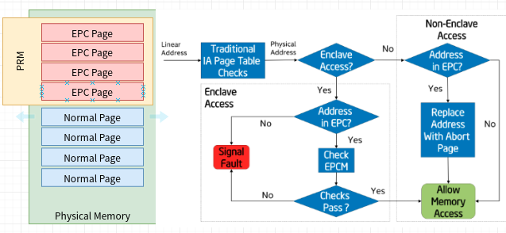
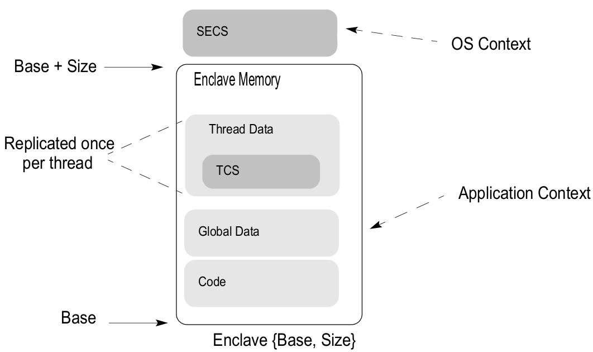

# Enclave机制

## 数据结构

### SECINFO

SESCINFO关于EPC页的一些安全元信息。

| 字段名 | 偏移 | 大小 | 描述 |
| :--- | :--- | :--- | :--- |
| FLAGS | 0 | 8 | epc页状态，参考 Flag字段 |
| RESERVED | 8 | 56 |  |

#### Flag字段

| 字段名 | 位 | 描述 |
| :--- | :--- | :--- |
| R | 0 | 是否只读 |
| W | 1 | 是否可写 |
| X | 2 | 是否可执行 |
| PENDING | 3 | 是否在Pending状态 |
| MODIFIED | 4 | 是否在Modified状态 |
| PR | 5 | 是否某种权限限制的操作正在执行 |
| RESERVED | 6-7 | 保留位，必须是0 |
| PAGE\_TYPE | 8-15 | 页类型 |
| RESERVED | 16-63 | 保留位，必须是0 |

### PAGEINFO

EPC相关指令依赖`PAGEINFO`结构参数:

| 字段名 | 偏移 | 大小 | 描述 |
| :--- | :--- | :--- | :--- |
| LINADDR | 0 | 8 | 线性地址 |
| SRCPGE | 8 | 8 | 源页地址 |
| SECINFO/PCMD | 16 | 8 | SECINFO地址或PCMD地址 |
| SECS | 24 | 8 | SESC的EPC页地址 |

## PRM



`PRM` 是处理器保留内存\(Processor Reserved Memory \(PRM\)\)的简称，是主内存的一部分，其它\(系统\)软件\(也包括DMA等硬件\)都无法直接访问。

Enclave的数据和代码存放在PRM中，存放这些数据和代码的内存被称为`EPC`。

### 内存区域

PRM被物理编码在内存的多个区块，可以通过CPUID指令查询:

```c
for (i = 0; i < SGX_MAX_EPC_BANKS; i++) {
		cpuid_count(SGX_CPUID, i + SGX_CPUID_EPC_BANKS, &eax, &ebx,
			    &ecx, &edx);
		if (!(eax & 0xf))
			break;

		pa = ((u64)(ebx & 0xfffff) << 32) + (u64)(eax & 0xfffff000);
		size = ((u64)(edx & 0xfffff) << 32) + (u64)(ecx & 0xfffff000);

		dev_info(parent, "EPC bank 0x%lx-0x%lx\n", pa, pa + size);

		sgx_epc_banks[i].pa = pa;
		sgx_epc_banks[i].size = size;
}
```

驱动程序加载日志:

```text
[    2.970981] intel_sgx: Intel SGX Driver v0.10
[    2.971003] intel_sgx INT0E0C:00: EPC bank 0x90200000-0x95f80000
[    2.975494] intel_sgx: second initialization call skipped
```

### EPC

`EPC`是Enclave Page Cache的简称，是PRM的一部分，enclave本身的数据和代码存放在这些内存中。EPC由一系列内存页\(4KB\)组成，Intel SGX通过`EPCM`数据结构管理这些EPC页\(EPC Page\)，并记录这些页的属性信息。

### EPCM

`EPCM`是Enclave Page Cache Map的简称，是PRM中一个数组结构，每个EPC页在EPCM都有一项，用于记录该页的EPC信息:

| Field | Description |
| :--- | :--- |
| VALID | 0代表该页不是EPC页 |
| R | 是否可读 |
| W | 是否可写 |
| X | 是否可执行 |
| PT | 页类型 |
| ENCLAVESECS | Enclave SECS结构的内存页地址 |
| ENCLAVEADDRESS | 该页线性虚拟地址 |
| BLOCKED | block状态标识 |
| PENDING | pending状态标识 |
| MODIFIED | 修改状态标识 |

处理器根据EPCM的信息对Enclave中的数据和代码进行保护:

1. 确定将要访问的地址是否是一个EPC页
2. 确定EPC页属于的Enclave，防止被其它Enclave的代码访问
3. 确定EPC页的数据或代码是否可读、可写或可执行。
4. 确定当前EPC页的状态，保证EPC页被正常使用

### EPC页类型

EPC内存页中存放的数据有多种不同的类型，按照数据类型将EPC页分为以下类型:

| 页类型 | 数据类型和作用 |
| :--- | :--- |
| PT\_SECS | 存放一个Enclave控制结构数据\(SGX Enclave  Control Structure\) |
| PT\_TCS | 存放Enclave线程控制结构数据\(Thread Control Structure\) |
| PT\_REG | 存放常规的Enclave数据和代码 |
| PT\_VA | 存放Version Array数据 |
| PT\_TRIM | 表明正在从Enclave的EPC中移除 |

### 寄存器

处理器内部存在一些控制寄存器\(CREG\)用来存储和控制SGX的执行状态。这些寄存器软件无法访问，并且取决于具体的实现。

| 寄存器名 | 大小\(Bit\) | 作用 |
| :--- | :--- | :--- |
| CR\_ENCLAVE\_MODE | 1 | 处理器当前是否处于Encave执行模式 |

### 驱动程序

Intel SGX驱动程序包含如下功能:

* EPC内存页管理: 分配、释放、回收等
* EPC内存页页表映射管理
* 调试模块下EPC内存页数据访问
* ....

## SECS



### SECS结构

`SECS`是`SGX EnclaveControl Structure`的缩写, 存放Enclave的元信息:

* 每个Enclave都有一个SECS结构，通过SECS结构可以唯一索引到Enclave。
* SECS结构占用一个EPC页，页类型是`PT_SECS`。EPC页在创建Enclave时被分配，内存页不需要映射为Enclave线性地址，也不需要映射到进程地址空间。

`SESC`结构包含以下Enclave元信息:

| 字段 | 偏移 | 大小\(Byte\) | 描述 |
| :--- | :--- | :--- | :--- |
| SIZE | 0 | 8 | Enclave占用的内存大小，必须是2的幂 |
| BASEADDR | 8 | 8 | Enclave的起始地址\(虚拟地址\) |
| SSAFRAMESIZE | 16 | 4 | SSA帧大小，以页\(4KB\)为单位 |
| MISCSELECT | 20 | 4 | 与SSA帧相关，用于存放扩展功能的位向量 |
| RESERVED | 24 | 24 | 保留位 |
| ATTRIBUTES | 48 | 16 | Enclave属性 |
| MRENCLAVE | 64 | 32 | Enclave标识 |
| RESERVED | 96 | 32 | 保留位 |
| MRSIGNER | 128 | 32 | Enclave提供者标识 |
| RESERVED | 160 | 32 | 保留位 |
| CONFIGID | 192 | 64 | Post EINIT configuration identity |
| ISVPRODID | 256 | 2 | Product ID of Enclave |
| ISVSVN | 258 | 2 | Security version number \(SVN\) of the enclave. |
| CONFIGSVN | 260 | 2 | Post EINIT configuration security version number |
| RESERVED | 262 | 3834 | 保留位 |

### Enclave属性\(Attribute\)

SECS.ATTIBUTES按位定义一些Encave属性，这些属性会在后续操作被使用\(KEYREQUEST, REPORT等\):

| 字段 | 位置 | 作用 |
| :--- | :--- | :--- |
| INIT | 0 | 表明当前Enclave是否已经被EINIT指令初始化 |
| DEBUG | 1 | 当前Enclave是否开启调试模式 |
| MODE64BIT | 2 | 当前Enclave是否运行在64位模式 |
| RESERVED | 3 | 保留位，必须是0 |
| PROVISIONKEY | 4 | 是否可以通过EGETKEY指令获取Provisioning Key |
| EINITTOKEN\_KEY | 5 | 是否可以通过EGETKEY指令获取EINIT token key |
| RESERVED | 6 | 必须是0 |
| KSS | 7 | Key Separation and Sharing Enabled |
| RESERVED |  8-63 |  Must be zero |
|  XFRM |  64-127 |  XSAVE Feature Request Mask |

### MISCSELECT

当`AEX`发生时，指令`CPUID.(EAX=12H, ECX=0):EBX[31:0]`会枚举一些CPU扩展信息并存储在SSA帧的MISC区域。Enclave提供者可以通过指定`SECS.MISCSELECT`位向量，从而选择要添加SSA帧的CPU扩展信息:

| 字段 | 位置 | 功能 |
| :--- | :--- | :--- |
| EXINFO | 0 | 报告发生在Enclave内的页错误和GP异常信息。 |
| Reserved | 1-31 | 保留 |

### MRENCLAVE

MRENCLAVE通过计算Enclave的内容得出，可用于唯一标识一个运行中的Enclave

```bash

```

### MRSIGNER

MRSIGNER用于标识Enclave的代码提供者, 计算方式是对代码提供者的RSA公钥Modulus参数小端序进行sha256哈希

```go
	data, _ := ioutil.ReadFile("raw/private.pem")
	block, _ := pem.Decode(data)
	pri, err := x509.ParsePKCS1PrivateKey(block.Bytes)
	if err != nil {
		log.Fatalf("err:%v", err)
	}
	pubKey := pri.Public().(*rsa.PublicKey) //384位
	
	rbytes := []byte{}
	bytes := pubKey.N.Bytes() //大端序
	
	//大端序转小端序
	for i := len(bytes) - 1; i >= 0; i-- {
		rbytes = append(rbytes, bytes[i])
	}
    //哈希
	hash := sha256.New()
	hash.Write(rbytes)
	out := hash.Sum(nil)
```

### ECREATE指令

指令`ECREATE`用来在EPC内存中初始化一个SESC结构，这个创建一个Enclave的第一步。指令接收两个参数:

* 源SECS结构页信息
* 目标EPC页地址

指令将源SECS结构拷贝到目标EPC页，并在EPCM设置对应页的信息。

## EPC页管理

使用`ECREATE`指令在EPC内存中创建SECS实例后，一个新的Enclave实例就创建成功，Intel SGX提供一些指令用于向Enclave添加新页，或者管理已有的EPC页。

### EADD指令

`EADD`指令向Enclave添加一个新页，指令参数包括:

* 源内存页的PAGEINFO实例地址
* 目标EPC页地址

指令会将源内存的内容复制到指定的EPC页，并将EPC页的源信息更新到SECS.MRECLAVE字段。

### EEXTEND指令

当一个新的EPC页被添加到Enclave后，可以将页的内容更新到SECS.MRENCLAVE字段，从而保证代码和数据在构造Enclave过程中没有被篡改，EEXTEND指令可以完成这一功能，指令参数:

* 目标Enclave的SECS实例地址
* 目标EPC页中256字节内存块的地址

指令一次性将EPC页的256字节大小的内存块更新到SECS.ENCLAVE字段中。\

## EINIT指令

当所有的代码和数据已经加载到Enclave后，需要对Enclave进行初始化操作，操作结束后就可以执行Enclave里的代码。

### SIGSTRUCT

结构由Enclave开发者构造并签名，在EINIT阶段用来确认Enclave被合法地构造完成。

<table>
  <thead>
    <tr>
      <th style="text-align:left">&#x5B57;&#x6BB5;</th>
      <th style="text-align:left">&#x504F;&#x79FB;</th>
      <th style="text-align:left">&#x5927;&#x5C0F;(&#x5B57;&#x8282;)</th>
      <th style="text-align:left">&#x63CF;&#x8FF0;</th>
      <th style="text-align:left">&#x662F;&#x5426;&#x7B7E;&#x540D;</th>
    </tr>
  </thead>
  <tbody>
    <tr>
      <td style="text-align:left">HEADER</td>
      <td style="text-align:left">0</td>
      <td style="text-align:left">16</td>
      <td style="text-align:left">&#x56FA;&#x5B9A;&#x503C;: 06000000E10000000000010000000000H</td>
      <td style="text-align:left">&#x662F;</td>
    </tr>
    <tr>
      <td style="text-align:left">VENDOR</td>
      <td style="text-align:left">16</td>
      <td style="text-align:left">4</td>
      <td style="text-align:left">
        <p>Intel Enclave: 00008086H</p>
        <p>Non-Intel Enclave: 00000000H</p>
      </td>
      <td style="text-align:left">&#x662F;</td>
    </tr>
    <tr>
      <td style="text-align:left">DATE</td>
      <td style="text-align:left">20</td>
      <td style="text-align:left">4</td>
      <td style="text-align:left">&#x65E5;&#x671F;</td>
      <td style="text-align:left">&#x662F;</td>
    </tr>
    <tr>
      <td style="text-align:left">HEADER2</td>
      <td style="text-align:left">24</td>
      <td style="text-align:left">16</td>
      <td style="text-align:left">&#x56FA;&#x5B9A;&#x503C;: 01010000600000006000000001000000H</td>
      <td style="text-align:left">&#x662F;</td>
    </tr>
    <tr>
      <td style="text-align:left">SWDEFINED</td>
      <td style="text-align:left">40</td>
      <td style="text-align:left">4</td>
      <td style="text-align:left">&#x8F6F;&#x4EF6;&#x81EA;&#x7531;&#x4F7F;&#x7528;</td>
      <td style="text-align:left">&#x662F;</td>
    </tr>
    <tr>
      <td style="text-align:left">RESERVED</td>
      <td style="text-align:left">44</td>
      <td style="text-align:left">84</td>
      <td style="text-align:left">&#x5FC5;&#x987B;&#x662F;0</td>
      <td style="text-align:left">&#x662F;</td>
    </tr>
    <tr>
      <td style="text-align:left">MODULUS</td>
      <td style="text-align:left">128</td>
      <td style="text-align:left">384</td>
      <td style="text-align:left">Module Public Key</td>
      <td style="text-align:left">&#x5426;</td>
    </tr>
    <tr>
      <td style="text-align:left">EXPONENT</td>
      <td style="text-align:left">512</td>
      <td style="text-align:left">4</td>
      <td style="text-align:left">RSA Exponent = 3</td>
      <td style="text-align:left">&#x5426;</td>
    </tr>
    <tr>
      <td style="text-align:left">SIGNATURE</td>
      <td style="text-align:left">516</td>
      <td style="text-align:left">384</td>
      <td style="text-align:left">&#x7B7E;&#x540D;</td>
      <td style="text-align:left">&#x5426;</td>
    </tr>
    <tr>
      <td style="text-align:left">MISCSELECT*</td>
      <td style="text-align:left">900</td>
      <td style="text-align:left">4</td>
      <td style="text-align:left">&#x6269;&#x5C55;SSA Frame&#x5C4F;&#x853D;&#x4F4D;&#x5411;&#x91CF;</td>
      <td
      style="text-align:left">&#x662F;</td>
    </tr>
    <tr>
      <td style="text-align:left">MISCMASK*</td>
      <td style="text-align:left">904</td>
      <td style="text-align:left">4</td>
      <td style="text-align:left">Bit vector mask of MISCSELECT to enforce</td>
      <td style="text-align:left">&#x662F;</td>
    </tr>
    <tr>
      <td style="text-align:left">RESERVED</td>
      <td style="text-align:left">908</td>
      <td style="text-align:left">4</td>
      <td style="text-align:left">&#x4FDD;&#x7559;&#xFF0C;&#x5FC5;&#x987B;&#x662F;0</td>
      <td style="text-align:left">&#x662F;</td>
    </tr>
    <tr>
      <td style="text-align:left">ISVFAMILYID</td>
      <td style="text-align:left">912</td>
      <td style="text-align:left">16</td>
      <td style="text-align:left">ISV assigned Product Family ID</td>
      <td style="text-align:left">&#x662F;</td>
    </tr>
    <tr>
      <td style="text-align:left">ATTRIBUTES</td>
      <td style="text-align:left">928</td>
      <td style="text-align:left">16</td>
      <td style="text-align:left">Enclave&#x5C5E;&#x6027;</td>
      <td style="text-align:left">&#x662F;</td>
    </tr>
    <tr>
      <td style="text-align:left">ATTRIBUTEMASK</td>
      <td style="text-align:left">944</td>
      <td style="text-align:left">16</td>
      <td style="text-align:left">Mask of Attributes to enforce</td>
      <td style="text-align:left">&#x662F;</td>
    </tr>
    <tr>
      <td style="text-align:left">ENCLAVEHASH</td>
      <td style="text-align:left">960</td>
      <td style="text-align:left">32</td>
      <td style="text-align:left">&#x76EE;&#x6807; enclave hash</td>
      <td style="text-align:left">&#x662F;</td>
    </tr>
    <tr>
      <td style="text-align:left">RESERVED</td>
      <td style="text-align:left">992</td>
      <td style="text-align:left">16</td>
      <td style="text-align:left">Must be zero</td>
      <td style="text-align:left">&#x662F;</td>
    </tr>
    <tr>
      <td style="text-align:left">ISVEXTPRODID</td>
      <td style="text-align:left">1008</td>
      <td style="text-align:left">16</td>
      <td style="text-align:left">ISV assigned extended Product ID</td>
      <td style="text-align:left">&#x662F;</td>
    </tr>
    <tr>
      <td style="text-align:left">ISVPRODID</td>
      <td style="text-align:left">1024</td>
      <td style="text-align:left">2</td>
      <td style="text-align:left">ISV assigned Product ID</td>
      <td style="text-align:left">&#x662F;</td>
    </tr>
    <tr>
      <td style="text-align:left">ISVSVN</td>
      <td style="text-align:left">1026</td>
      <td style="text-align:left">2</td>
      <td style="text-align:left">ISV assigned SVN (security version number)</td>
      <td style="text-align:left">&#x662F;</td>
    </tr>
    <tr>
      <td style="text-align:left">RESERVED</td>
      <td style="text-align:left">1028</td>
      <td style="text-align:left">12</td>
      <td style="text-align:left">Must be zero</td>
      <td style="text-align:left">&#x5426;</td>
    </tr>
    <tr>
      <td style="text-align:left">Q1</td>
      <td style="text-align:left">1040</td>
      <td style="text-align:left">384</td>
      <td style="text-align:left">Q1 value for RSA Signature Verification</td>
      <td style="text-align:left">&#x5426;</td>
    </tr>
    <tr>
      <td style="text-align:left">Q2</td>
      <td style="text-align:left">1424</td>
      <td style="text-align:left">384</td>
      <td style="text-align:left">Q2 value for RSA Signature Verification</td>
      <td style="text-align:left">&#x5426;</td>
    </tr>
  </tbody>
</table>### EINITTOKEN

EINIT TOKEN STRUCTURE的简称，用来校验目标Enclave允许启用。EINITTOKEN由`Launch Enclave`生成。

| 字段 | 偏移 | 大小\(字节\) | 描述 | MACed?? |
| :--- | :--- | :--- | :--- | :--- |
| Valid | 0 | 4 | 第0位: 1代表有效，0代表无效 | Y |
| RESERVED | 4 | 44 | 必须是0 | Y |
| ATTRIBUTES | 48 | 16 | Enclave属性 | Y |
| MRENCLAVE | 64 | 32 | Enclave的MRENCLAVE值 | Y |
| RESERVED | 96 | 32 | 保留 | Y |
| MRSIGNER | 128 | 32 | Enclave的MRSIGNER值 | Y |
| RESERVED | 160 | 32 | 保留 | Y |
| CPUSVNLE | 192 | 16 | Launch Enclave’s CPUSVN | N |
| ISVPRODIDLE | 208 | 2 | Launch Enclave’s ISVPRODID | N |
| ISVSVNLE | 210 | 2 | Launch Enclave’s ISVSVN | N |
| RESERVED | 212 | 24 | 保留 | N |
| MASKEDMISCSELECTLE | 236 | 4 | Launch Enclave’s MASKEDMISCSELECT | N |
| MASKEDATTRIBUTESLE | 240 | 16 | Launch Enclave’s MASKEDATTRIBUTES | N |
| KEYID | 256 | 32 | Value for key wear-out protection | N |
| MAC | 288 | 16 | Message Authentication Code on EINITTOKEN using EINITTOKEN\_KEY | N |

### 校验SIGSTRUCT

1. 校验SIGSTRUCT签名
2. 校验enclave的`secs.enclave`与`SIGSTRUCT.MRENCLAVE`相等

### 校验EINITTOKEN

* EINITTOKEN中的attributes, mrenclave, mrsigner必须和enclave的sesc中的attributes, mrenclave, mrsigner值一致
* EINITTOKEN用debug launch key创建，则enclave必须处于debug模式

### 初始化Enclave

将enclave的INIT属于置1。

## MRENCLAVE计算

Measurement Register of enclave build process的简称，用来确认代码和数据在加载到Enclave过程中没有被篡改，计算结果被放在`SECS.MRENCLAVE`字段中，该值可以唯一标识一个Enclave。

```text
secs.mrenclave = sha2.initialization();
do
   if ECREATE:
      sesc.mr_enclave=sha2.submit(ECREATE_INFO);
   else if EADD:
      sesc.mrenclave=sha2.submit(EADD_INFO);
   else if EEXTEND:
	  sesc.mrenclave=sha2.submit(EXTEND_INFO);
   else if EINIT:
      sesc.mrenclave=sha2.done();
      break;
done;
```

### ECREATE指令

`ECREATE`指令会参与MRENCLAVE的计算:

* 初始化mrenclave计算:

```text
secs.mrenclave = sha2.initialization();
counter = 0;  //用于记录mrenclave更新次数
```

* 将SESC结构信息更新到mrenclave值

```text
tmp := [64]byte{}
tmp[0:7] = 0045544145524345H;  //"ECREATE"
tmp[8:11]  = SECS.SSAFRAMESIZE
tmp[12:19] = SECS.SIZE
tmp[19:63] = 0
secs.mrenclave = sha2.update(secs.mrenclave, tmp)
counter += 1;
```

### EADD指令

`EADD`指令将新添加的EPC页的元信息更新到mrenclave值:

```text
enclave_offset = page_lineaddr - sesc.baseaddr  //计算新添加的epc页相对enclave基址的偏移
tmp := [64]byte{}
tmp[0:7] = 0000000044444145H;   //"EADD"
tmp[8:15] = enclave_offset;
tmp[16:63] = sesc_info;
secs.mrenclave = sha2.update(sesc.mrenclave, tmp);
counter += 1;
```

### EEXTEND指令

`EEXTEND`指令将新添加的EPC页内容更新到mrenclave值，每次提交256字节

```text
//block_lineaddr是epc页中256字节块的起始地址， block是目标块内容
block := [256]byte{}
enclave_offset = block_lineaddr - sesc.baseaddr; //epc页中目标块的起始地址与enclave的基址的偏移
tmp := [64]byte{}
tmp[0:7] = 00444E4554584545H; //  "EEXTEND"
tmp[8:15] = enclave_offset;
tmp[16:63] = 0;
secs.mrenclave = sha2.update(sesc.mrenclave, tmp);
counter += 1;

sesc.mrenclave = sha2.update(sesc.mrenclave, block[0:63];
sesc.mrenclave = sha2.update(sesc.mrenclave, block[64:127];
sesc.mrenclave = sha2.update(sesc.mrenclave, block[128:191];
sesc.mrenclave = sha2.update(sesc.mrenclave, block[192:255];
counter += 4;
```

### EINIT指令

`EINIT`指令会结束mrenclave的计算过程:

```text
secs.mrenclave = sha2.final(sesc.mrenclave, count*512);  //counter是mrenclave的更新次数
```

