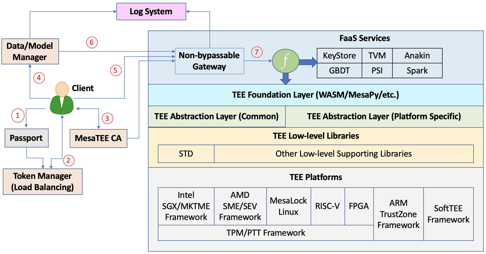

# MesaTEE介绍

## 架构设计

### TEE平台和支持层

MesaTEE支持主流的TEE软硬件实现，TEE Low-level Libraries实现对不同TEE实现的接入，并且向上层提供不同TEE实现的差异化特性

### TEE抽象层

由于平台和支持层随机TEE实现的软硬件演进可能出现较大的变动，所以提供了TEE抽象层，该层向应用提供了稳定、一致的访问接口。

### TEE基础层

将抽象层提供的API适配更多的编程框架\(如WASM, MesaPy等\)，更方便的提供应用接入。

###  应用服务层

基于MesaTEE基础框架开发的服务，满足更多具体的场景应用。

## 参考资料

* [https://github.com/mesalock-linux/mesatee](https://github.com/mesalock-linux/mesatee)

